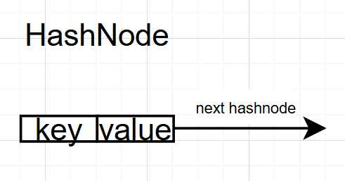
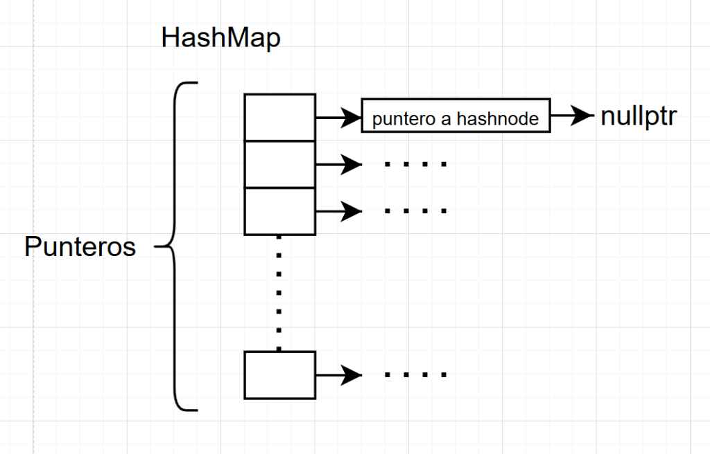
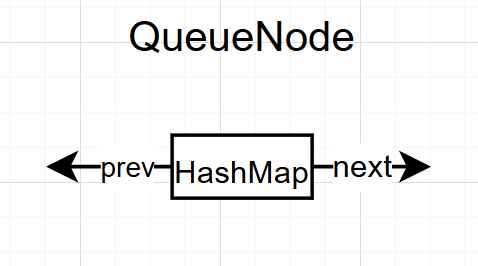
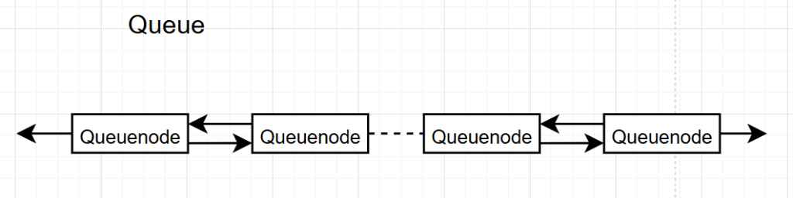

# EDA_final
## Requisitos Previos

Para compilar este proyecto se necesita tener instalado:

1.  **Visual Studio Code** VSCodeUserSetup-x64-1.106.2.exe
2.  **Compilador de C++:** Compatible con C++11 o superior.
3.  **CMake Tools:** en VSC.
4.  **Python:** Versión 3.13.5
5.  **Pybind11:** Librería para conectar C++ y Python.
6.  **spacy:** NLP de python

### Instalación de dependencias (Python)
```bash
pip install pybind11
pip install scipy
```
### Compilación
1.  Descargar todos los archivos del .zip o de la carpeta EDA_final.
2.  Abrir esta carpeta en Visual Studio Code.
3.  Asegurarse que todo lo nombrado arriba esté instalado.
4. Para asegurarse de que el programa funcione bien se debe hacer lo siguiente:
   1. Se presiona **Ctrl + Shift + P** y se selecciona la opción **CMake: Configure**. Esto permite leer el archivo `CMakeLists.txt` y preparar todo.
   2. Después, nuevamente se presiona **Ctrl + Shift + P** y se selecciona **CMake: Build** o se presiona **F7**.
   3. Luego de esto se creará automáticamente una carpeta llamada **build**. Dentro de ella se encontrará otra carpeta llamada **debug**, donde estará un archivo `.pyd`.
   4. Este archivo `.pyd` se debe mover a la misma carpeta donde se encuentra `main.py`, reemplazando el archivo `.pyd` anterior que se descargó.

5.  Se abre una nueva terminal y se ejecuta el comando  ```bash python main.py```
### Observaciones
*   En `main.py` (linea 11 y 12) se encuentra el k y el número de palabras de la word cloud, esas variables pueden ser modificadas a gusto de quien lo compile.
*   Asegurarse que en el `main.py` (linea 13) se haga referencia a la carpeta donde estan las noticias.

## Arquitectura de la Estructura de datos
En el siguiente proyecto se usaron 2 estructuras de datos, Tabla Hash y Queue. Donde se generan k tablas hash que se almacenan en el queue y se crea una tabla hash general que almacena toda la data del queue.
Estas Estructuras de datos están formadas de la siguiente manera
### Tabla hash
Esta Tabla Hash, primeramente esta formada de un array(Figura 2), pero este array es un array de punteros a nodos(Figura 1) donde cada nodo tiene 3 variables: key,estas son las palabras que potencialmente aparecerán en la wordcloud; value, es la cantidad de veces que se repite la key; y por último, un puntero que en caso de colisión apuntará a otro nodo. 
La tabla hash tiene un array estático que en el TopicManager se escoge según se vea necesario para no tener colisiones. 
Esta tabla hash se eligió debido a que su tiempo de inserción, eliminación y consulta es de O(1) la mayoría de veces (excepto en colisiones), esto hace que sea eficiente a la hora de aplicarlo.

#### Figura 1. HashNode

#### Figura 2. HashMap

### Queue
Esta queue (Figura 4), primeramente es una lista enlazada, está formado por queuenode (Figura 3) donde cada nodo esta compuesta por 3 partes: hashmap, este es un puntero a una tabla hash; prev, es un puntero que señala al nodo previo; y por último a next, un puntero que apunta al nodo siguiente. 
La queue es la lista enlazada de cada queuenode, pero a esto se le suma 2 punteros más, un head, que apunta al elemento mas antiguo en la queue y un tail, que apunta al elemento más nuevo.
Se eligió esta estructura debido a que se deben almacenar las k noticias mas recientes, así que con sus funciones push_back y pop_front la hacia la mejor opción.
#### Figura 3. QueueNode

#### Figura 4. Queue



